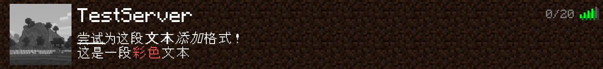

<div align="center">
    
    <h1>Just Enough McServer Status</h1>
</div>

[](https://www.gnu.org/licenses/agpl-3.0)
[](https://github.com/NightVoyager14/astrbot_plugin_just_enough_mcserver_status)
[](https://www.python.org/)
[](https://github.com/NightVoyager14/astrbot_plugin_just_enough_mcserver_status)
[](https://github.com/AstrBotDevs/AstrBot)

> 一个为AstrBot实现Minecraft服务器查询功能的插件，图片渲染本地化，不依赖外部服务

## 写在前面

本插件处于*开发中（InDev）*，核心功能可用，但尚不完善  
如果你有遇到BUG或者有功能建议，欢迎提 [Issue](https://github.com/NightVoyager14/astrbot_plugin_just_enough_mcserver_status/issues) 反馈！

## 效果展示



## 插件功能

- **`/jeping status <服务器地址[:端口]> [名称]`** — 获取 Java 版服务器状态（在线人数、MOTD、延迟等）
- **`/jemss version`** — 查看插件版本
- **`/jemss splash`** — 随机获取一条启动标语
- **`/jemss admin`** (管理员) — 管理员测试指令
- **`/jemss help`** — 显示帮助信息

## 插件配置

插件在 *未来* 计划开放更多可自定义选项并添加UI界面  
目前位于插件根目录下`config.toml`下，且只有一个配置项`ping_thresholds`

```toml
# 设置ping不同图标的显示范围
[ping_thresholds]
excellent = 50
good = 100
medium = 200
bad = 500
```

## 特别感谢

感谢 [mctext](https://github.com/Hexze/mctext) 提供的Minecraft字体文件  
感谢 [mcstatus](https://github.com/py-mine/mcstatus) 提供的Minecraft服务器查询与解析实现

<div align="center">


私は、高性能ですから！Minecraftの対応も、もちろんお手の物です！
</div>

---

**Disclaimer:** This project is **NOT AN OFFICIAL MINECRAFT PRODUCT**. It is **NOT APPROVED BY OR ASSOCIATED WITH MOJANG OR MICROSOFT**.
